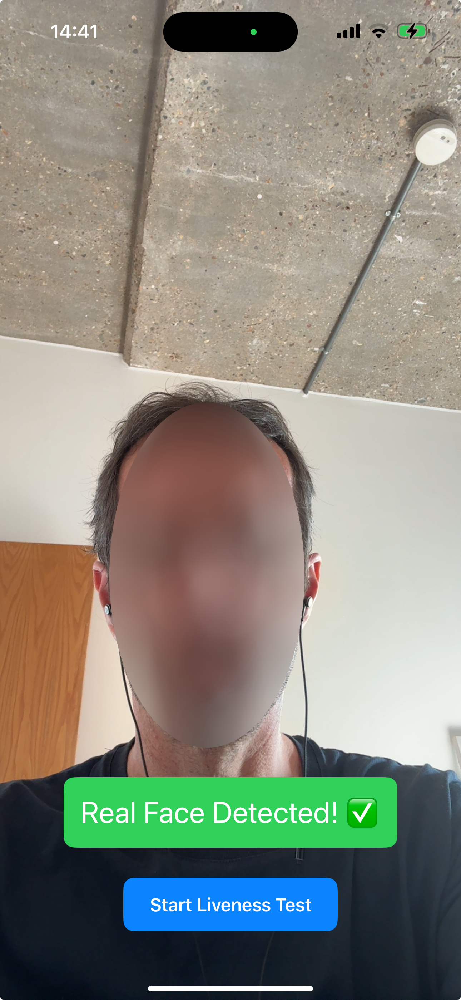

# iOS Face Liveness Detection App

A proof-of-concept iOS application that demonstrates face liveness detection using the device's front-facing TrueDepth camera capabilities. The app distinguishes between real human faces and spoof attempts such as photos, videos, or 3D masks.

## Features

- **Real-time Face Detection**: Identifies human faces in the camera feed
- **Advanced Liveness Assessment**: Analyzes 3D depth data to verify the face is real and not a spoof
- **3D Mask Detection**: Specialized checks for detecting sophisticated 3D mask spoof attempts
- **Timed Testing Flow**: 5-second test cycle with clear pass/fail results
- **Privacy-Focused**: All processing happens on-device with no data storage or transmission

## System Requirements

- iPhone with TrueDepth camera (iPhone X or newer)
- iOS 15.0+
- Xcode 13.0+ for development

## Implementation Architecture

### Core Components

The application follows a clean architecture with the following key components:

1. **ContentView.swift**
   - Main SwiftUI interface that coordinates the user experience
   - Manages test cycle timing and user feedback
   - Coordinates between UI and camera/detection systems
   - Provides real-time feedback during face detection process
   - Handles test state management and result display

2. **CameraManager.swift**
   - Handles camera setup, permissions, and configuration
   - Manages AVCaptureSession and camera inputs/outputs
   - Processes both regular video and depth data streams
   - Performs preliminary depth analysis for liveness detection
   - Coordinates between FaceDetector and UI components

3. **FaceDetector.swift**
   - Uses Apple's Vision framework for face detection
   - Implements sophisticated depth-based liveness verification
   - Performs statistical analysis on depth data
   - Includes specialized 3D mask detection algorithms
   - Maintains temporal consistency checks

4. **CameraPreview.swift**
   - Bridge between SwiftUI and AVCaptureVideoPreviewLayer
   - Manages display of camera feed in the UI
   - Handles orientation changes and view lifecycle
   - Provides smooth camera preview performance

### Detection Process

The face liveness detection process works as follows:

1. The user initiates a test by tapping the "Start Liveness Test" button
2. The app starts a 5-second countdown timer with 0.1-second precision
3. During the test, the TrueDepth camera captures both regular video and depth data
4. The FaceDetector processes video frames to detect the presence of a face
5. The CameraManager analyzes depth data to determine if the face is three-dimensional
6. Real-time feedback is provided to guide the user for optimal face positioning
7. If a real face is detected before the timer expires, the test passes
8. If a face is detected but fails liveness checks, the test fails as a spoof
9. If no face is detected before the timer expires, the test times out

### Liveness Detection Approach

The app uses a sophisticated depth-based liveness detection system that:

1. **Multi-Point Analysis**: Samples up to 100 points across the face region in a 10x10 grid pattern to capture the 3D structure.

2. **Statistical Analysis**: Uses multiple statistical measures to distinguish real faces from spoofs:
   - Depth variation (standard deviation and range)
   - Edge and center region analysis
   - Gradient pattern analysis
   - Temporal consistency checks
   - Micro-movement analysis
   - Depth distribution symmetry
   - Pattern consistency over time

3. **Adaptive Thresholds**: Implements lenient but secure thresholds based on extensive testing:
   - Requires 6 out of 9 checks to pass for a positive result
   - Depth variation thresholds: stdDev >= 0.15, range >= 0.3
   - Acceptable depth range: 0.2-3.0m
   - Natural edge variation: edgeStdDev >= 0.15
   - Center region variation: centerStdDev >= 0.1
   - Gradient analysis: stdDev >= 0.005, mean <= 0.2
   - Temporal changes: 0.005-1.0m between frames
   - Micro-movement variance: stdDev >= 0.3 * mean
   - Depth symmetry: normalized score >= 0.05
   - Pattern consistency: mean < 0.9 or stdDev >= 0.1

4. **Robust Detection**: The system is designed to:
   - Handle natural face movement and variation
   - Account for different lighting conditions
   - Work with various face positions and distances
   - Maintain security while reducing false negatives
   - Detect sophisticated spoof attempts including 3D masks

5. **3D Mask Detection**: The system includes specialized checks for detecting 3D masks:
   - Analyzes micro-movement patterns in depth gradients
   - Checks for unnatural symmetry in depth distribution
   - Monitors temporal consistency of depth patterns
   - Detects uniform micro-movements typical of masks
   - Identifies overly perfect symmetry in 3D masks
   - Recognizes unnatural pattern consistency over time

In a production app, this would be enhanced with:
- More sophisticated depth map analysis
- Texture analysis for screen detection
- Blink detection or gesture challenges
- Machine learning models trained on spoof attempts

## How to Build and Run

1. Clone this repository
2. Open `cursor_19.xcodeproj` in Xcode
3. Select your development team in the project settings
4. Choose a target device with TrueDepth camera capabilities
5. Build and run (⌘+R)

## Testing

To test the application:

1. Launch the app and grant camera permissions when prompted
2. Position your face in the center of the screen
3. Tap the "Start Liveness Test" button to begin a 5-second test
4. The app will analyze your face and display one of three results:
   - "Real Face Detected! ✅" (Success)
   - "Spoof Detected! ❌" (Failed liveness check)
   - "No Face Detected! ⏱" (No face found within time limit)
5. Test the app's spoof detection by presenting a photo or video of a face

## Privacy Considerations

This application:
- Processes all data locally on the device
- Does not store or transmit any camera data or images
- Requires camera permission, which the user can revoke at any time
- Clearly communicates when the camera is in use

## Known Limitations

As a proof-of-concept, this application has the following limitations:

1. **3D Mask Detection**: While the system includes specialized checks for 3D masks, sophisticated masks with natural micro-movements and imperfections might still pass detection.
2. **Limited Testing Scenarios**: The app does not implement challenge-response mechanisms (like blinking) that would enhance spoof detection.
3. **Device Requirements**: Only works on devices with TrueDepth cameras.
4. **Performance Optimization**: The camera and detection processing could be further optimized for battery usage.

## Future Improvements

Areas for enhancement in a production version:

1. **Advanced Anti-Spoofing**: Implement multiple layers of spoof detection:
   - Enhanced 3D mask detection using machine learning models
   - Texture analysis for detecting printed or screen-based faces
   - Challenge-response mechanisms (blink detection, smile detection)
   - Machine learning models trained specifically on spoof attempts

2. **Performance Optimization**:
   - Reduce processing when not in active test mode
   - Optimize depth data analysis algorithms
   - Add caching mechanisms for detection results

3. **User Experience Enhancements**:
   - Add face positioning guides
   - Provide more detailed feedback on detection quality
   - Implement accessibility features

4. **Integration Options**:
   - SDK version for embedding in other applications
   - API for server verification of liveness results
   - Multi-factor authentication integration

## License

[Specify your license information here]

## Contributing

[Guidelines for contributing to the project]

## Acknowledgments

- Apple for TrueDepth camera and Vision framework APIs
- Google ML Kit documentation for liveness detection concepts 
